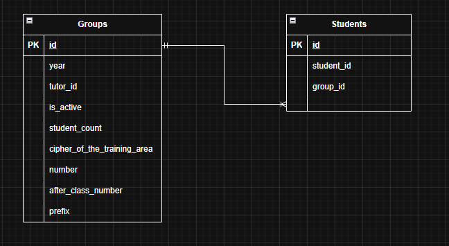

### Функции сервиса
#### Добавление группы.

| Параметр | Обязательность | Тип | Ограничение | Значение по умолчанию |
|---|---|---|---|---|
| Год поступления | Обязательно | Целое число | от 2000 до 2999 | — |
| id руководителя | Не обязательно | Целое число | строго больше 0 | `NULL` |
| Количество студентов | Не обязательно | Целое число | от 0 до 30 | 0|
| Шифр направления подготовки | Обязательно | Строка | вида `NN.NN.NN` (цифры, разделённые точками) | — |
| Номер группы | Обязательно | Целое число | строго больше 0 | — |
| После какого класса поступили | Обязательно | Целое число | строго 9 или 11 | — |
| Префикс | Обязательно | Строка | длина строки от 0 до 2 | — |

#### Получение списка активных групп по параметрам.

| Параметр | Тип | Условия фильтрации |
|---|---|---|
| Год поступления| целое число | меньше указанного, равно указанному, больше указанного |
| id руководителя| целое число | равно указанному |
| Количество студентов| целое число | меньше указанного, равно указанному, больше указанного |
| Шифр направления подготовки| строка | равно указанному |
| Номер группы| целое число | равно указанному |
| После какого класса поступили| целое число | равно указанному |

#### Получение информации о группе.

|Данные|
|---|
|Год поступления|
|id_руководителя|
|количество студентов|
|шифр направления подготовки|
|номер группы|
|После какого класса поступили|
|Префикс|

#### Изменение информации о определенной группе.

|Данные которые можно изменить|
|---|
|Руководитель|
|Количество студентов|
#### Удаление группы.

|Удаление|
|---|
|Подрозумевает под собой изменение статуса активности группы на неактивную|

ER-диаграмма

   
